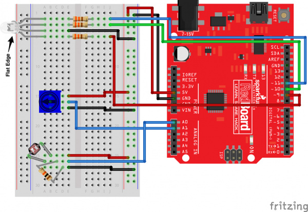
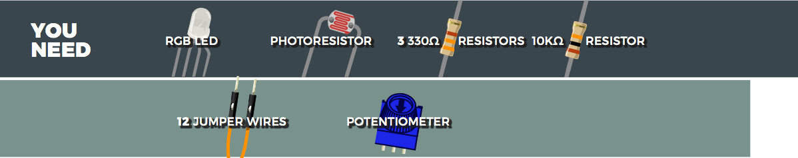
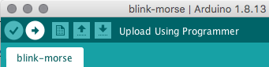

# RGB Night Light

### Running the Program
The program is compatible with an Arduino Uno board which was set up using a SparkFun Inventor's Kit. Following the instructions, the basic board set up should look like this: 

You will need:

The longest pin of the RGB light is the common or ground.

Arduino and USB drivers will need to be installed for the code to work. Go to www.arduino.cc/downloads to download Arduino and www.sparkfun.com/ch340 to download drivers. Pnce Arduino is installed you will need to select the correct board, in this case: Arduino Uno, and the correct port. Next, connect your board to the computer using an USB cable.

To run the code click on the upload button on the top left corner (second to left) on the arduino interface.

### The Code
The program is designed to

### Challenges
